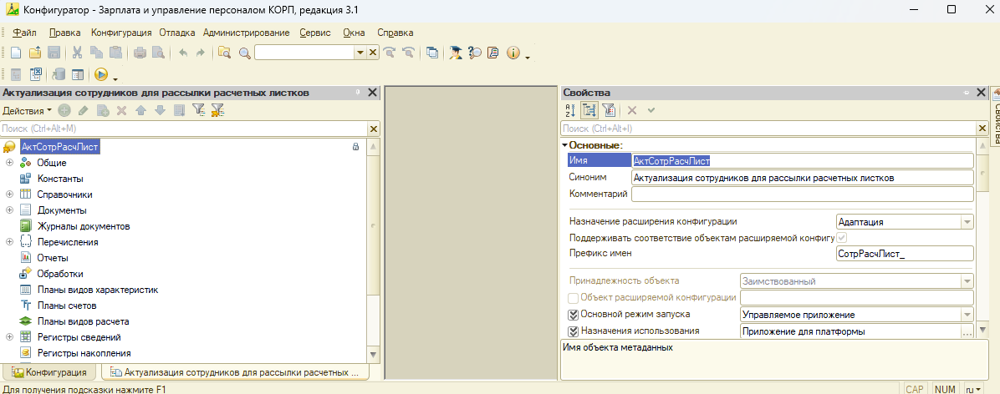

# Скрипт для автоматического обновления расширения из Хранилища

Текст скрипта:
```rem обязательно прочтите пояснение
rem к командам, которые начинаются c @
rem https://helpme1s.ru/obnovlyator-1s-uchimsya-pisat-paketnye-batch-skripty#i-20
rem эта подсказка перестанет вставляться сама через некоторое время
@update_ext(
    storage_path:"<путь_к_хранилищу_расширения>>",
    storage_version:"",
    storage_user_name:"<логин_пользователя-администратора>>",
    storage_user_password:"<пароль_пользователя-администратора>",
    ext_name:"<наименование_расширения_как_в_конфигураторе>>",
    create_if_not_exist:"False",
    safe_mode:"False",
    unsafe_operation_warnings:"False",
    used_in_distributed_info_base:"False",
    scope:"Auto",
    update_db:"True"
)
```


Пояснения:
* путь_к_хранилищу_расширения - например, ```D:\Repo1C\payslips_ext```
* логин_пользователя-администратора - например, ```admin_ext```
* пароль_пользователя-администратора - например, ```123qwerty456```
* наименование_расширения_как_в_конфигураторе - например, ```АктСотрРасчЛист```
